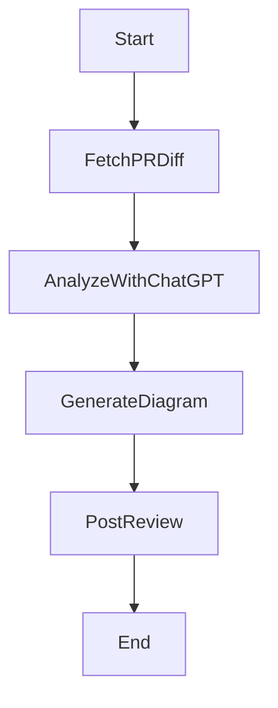

# 🤖 ChatGPT PR Review Bot

A **GitHub App** powered by **Probot** and **OpenAI GPT-4 Turbo** to automatically review **Pull Requests**, detect issues, provide suggestions, and generate **diagrams** (Mermaid.js or DALL·E) to enhance understanding.

---

## 🚀 Features
- **Automatic PR Review**: Reads pull request diffs and suggests improvements.
- **ChatGPT-Powered Suggestions**: Uses OpenAI's GPT-4 Turbo to analyze code quality and issues.
- **Mermaid.js Diagrams**: Generates sequence diagrams, flowcharts, and class diagrams for better visualization.
- **DALL·E Image Generation**: Optionally creates **custom AI-generated diagrams** to illustrate complex logic.

---

## 🛠️ Setup Instructions

### **1️⃣ Install Dependencies**
Make sure you have **Node.js** installed, then install the required packages:
```sh
npm install
```

### **2️⃣ Set Up OpenAI API Key**
Create a `.env` file and add your **OpenAI API key**:
```ini
OPENAI_API_KEY=your_openai_api_key_here
```

### **3️⃣ Set Up the GitHub App**
To setup the github app you can follow Protobot instructions in this page: [Protobot Configuring Github App](https://probot.github.io/docs/development/#configuring-a-github-app)

If the above guide doesn't work, please follow the steps below:
1. **Go to GitHub Developer Settings → GitHub Apps**: [GitHub Apps](https://github.com/settings/apps)
2. Click **New GitHub App** and configure:
   - **Webhook URL**: `https://smee.io/YOUR_UNIQUE_URL` (for local testing)
   - **Permissions**:
     - Pull Requests → Read & Write
     - Issues → Read & Write
   - **Subscribe to Events**:
     - `pull_request`
     - `issue_comment`
3. Generate **private keys** and store them in `.env`:
```ini
APP_ID=your_app_id
PRIVATE_KEY=your_private_key
WEBHOOK_SECRET=your_webhook_secret
```

4. **Install the GitHub App** on your repository and grant required permissions.

### **4️⃣ Run the Bot Locally**
To test your bot locally, use **Smee.io** to forward GitHub events:
```sh
npx smee --url https://smee.io/YOUR_UNIQUE_URL --path /events --port 3000
```
Then, start the bot:
```sh
npm start
```

---

## 📝 Example PR Review Output
When a new PR is created, the bot comments:
```
### 🤖 ChatGPT Review
#### Issues Found:
- 🚨 **Avoid using console.log in production code.**
- ⚠️ **Refactor repeated logic into a function.**

#### Suggested Fix:
- Use a logger instead of `console.log`
- Optimize repeated database queries

#### Diagram for Understanding:

```

---

## 🔗 Useful Links
- **Probot Docs**: [https://probot.github.io/](https://probot.github.io/)
- **GitHub Apps**: [https://docs.github.com/en/apps](https://docs.github.com/en/apps)
- **OpenAI API**: [https://platform.openai.com/](https://platform.openai.com/)
- **Mermaid.js**: [https://mermaid-js.github.io/](https://mermaid-js.github.io/)
- **Smee.io (GitHub Webhook Proxy)**: [https://smee.io/](https://smee.io/)

---

## 👨‍💻 Contributing
Feel free to fork, modify, and improve the bot! Open issues and PRs are welcome. 😊

---

## 📜 License
This project is licensed under the **MIT License**.

